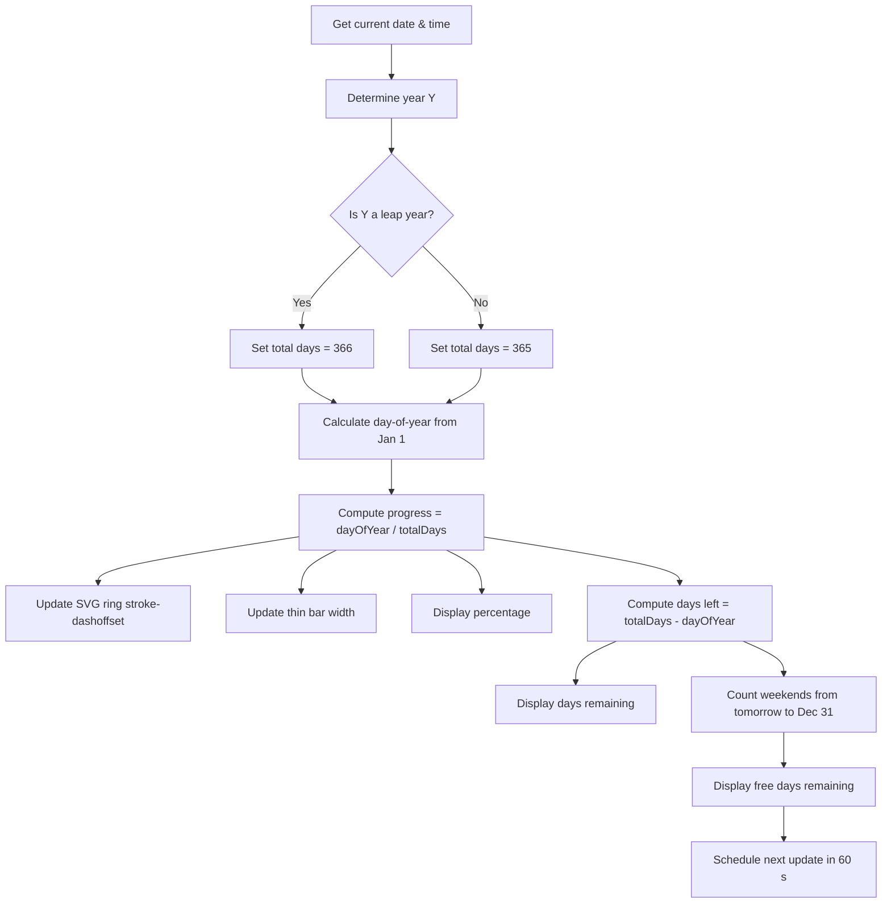

# Year Progress

<p align="center">
  <a href="https://soumendrak.github.io/yearprogress/">
    
  </a>
  <a href="LICENSE">
    
  </a>
  
  
</p>

<p align="center">
  
</p>

<br>

<p align="center">
  <!-- Inline SVG logo — progress ring graphic, dark themed -->
  <svg width="200" height="200" viewBox="0 0 200 200" xmlns="http://www.w3.org/2000/svg">
    <rect width="200" height="200" rx="32" fill="#1a1a1a"/>
    <circle cx="100" cy="100" r="72" fill="none" stroke="#2a2a2a" stroke-width="8"/>
    <circle cx="100" cy="100" r="72" fill="none" stroke="#ff6b35" stroke-width="8" stroke-linecap="round"
            stroke-dasharray="452.389" stroke-dashoffset="163.389" transform="rotate(-90 100 100)"/>
    <text x="100" y="106" text-anchor="middle" font-family="sans-serif" font-size="36" font-weight="800" fill="#ff6b35">64%</text>
    <text x="100" y="134" text-anchor="middle" font-family="sans-serif" font-size="12" fill="#555" letter-spacing="2">elapsed</text>
    <text x="100" y="172" text-anchor="middle" font-family="sans-serif" font-size="13" fill="#888" letter-spacing="1">YEAR PROGRESS</text>
  </svg>
</p>

<br>

**Year Progress** is a lightweight, single-file HTML page that shows how much of the current year has elapsed — a live year progress bar with a percentage ring, day-of-year counter, days remaining, and free days (weekends) remaining.

Inspired by [dayleft](https://github.com/soumendrak/dayleft).

---

## Features

- **Live percentage ring** — SVG circular progress indicator, updated every 60 seconds
- **Day of year counter** — current day number out of 365 or 366
- **Days remaining** — total days left in the year
- **Free days remaining** — count of Saturdays and Sundays left
- **Leap year detection** — automatically shows a LEAP badge and adjusts total days
- **Dark theme** — deep dark background with orange accent (#ff6b35)
- **Responsive** — works on desktop, tablet, and mobile
- **Zero dependencies** — no CDN, no frameworks, no external resources
- **Single file** — everything (HTML, CSS, JS) in one file, ready to deploy

---

## How It Works

The page calculates year progress entirely in the browser using JavaScript's `Date` API. The flow:



> The ring uses an SVG `<circle>` with `stroke-dasharray` and `stroke-dashoffset`. The circumference is `2 × π × radius`. As progress increases, the offset decreases, creating the fill animation.

---

## Live Demo

🔗 [**soumendrak.github.io/yearprogress/**](https://soumendrak.github.io/yearprogress/)

---

## Usage

1. Open `index.html` in any modern browser.
2. No build step, no server, no installation required.
3. Deploy on GitHub Pages, Netlify, or any static host.

```bash
# Clone the repo
git clone https://github.com/soumendrak/yearprogress.git

# Open directly
open yearprogress/index.html
```

---

## License

Licensed under the [MIT License](LICENSE).
---

<p align="center">
  <sub>Built with ❤️ and zero dependencies</sub>
</p>
